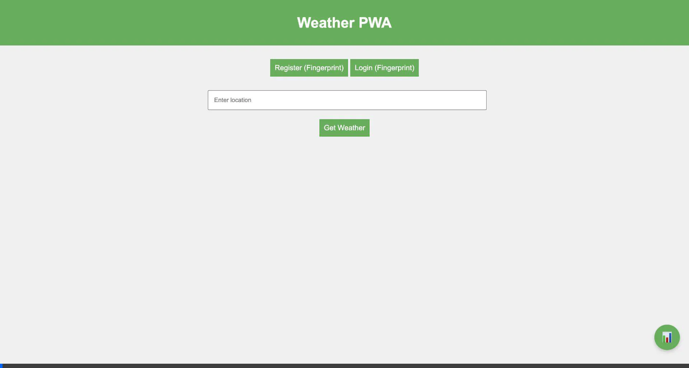
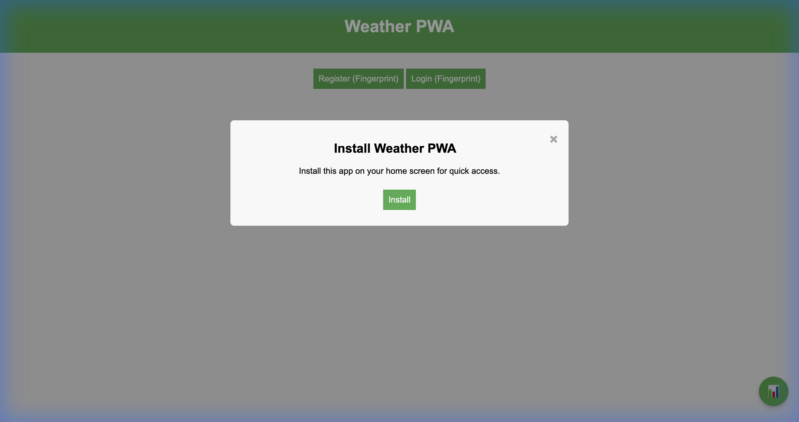
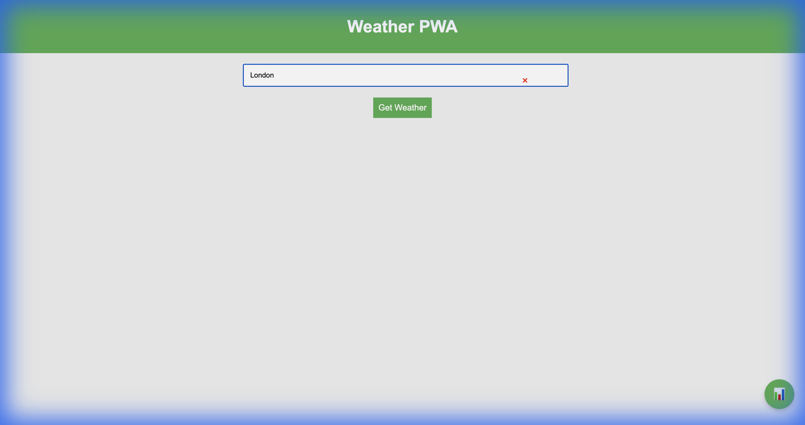
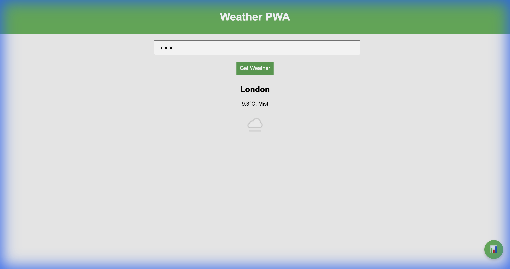
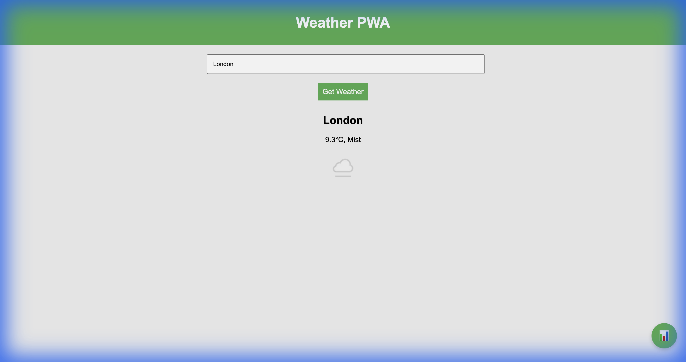
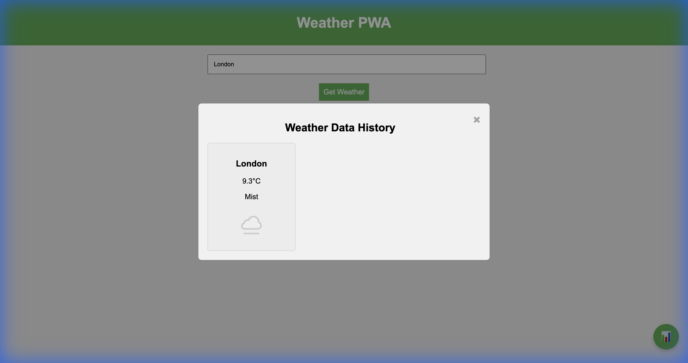

# Weather PWA

A Progressive Web App (PWA) that displays weather information. This app leverages a Weather API, Service Workers for
offline capabilities, and IndexedDB for persistent storage.

## Table of Contents

- [Features](#features)
- [Demo Screenshots](#demo-screenshots)
- [Developer Guide](#developer-guide)
- [User Guide](#user-guide)
- [Running the App](#running-the-app)
- [PWA Features](#pwa-features)
- [Contributing](#contributing)
- [License](#license)

## Features

- **Real-time Weather Updates:** Displays current weather information for searched locations.
- **Biometric Authentication:** Secure login using biometric authentication.
- **Offline Support:** Cached weather data is accessible when offline.
- **Weather History:** View previously searched weather information in a grid view.
- **Responsive Design:** Mobile and desktop-friendly interface.
- **Installable:** Can be added to the home screen on both Android and iOS devices.

## Demo Video



## Demo Screenshots

### Home Screen



### Weather Search



### Weather Details



### Offline Mode



### Weather History



## Developer Guide

### Prerequisites

- [Node.js](https://nodejs.org/)
- [npm](https://www.npmjs.com/)
- A Weather API key (e.g., [OpenWeatherMap](https://openweathermap.org/api)) if required by your implementation.

### Installation

1. **Clone the repository:**
   ```sh
   git clone https://github.com/yourusername/weather-pwa.git
   cd weather-pwa
   ```

2. **Install dependencies:** There are no external dependencies for this front-end project, but ensure you are familiar
   with service workers and PWAs.

### Running the Application

1. **Start a local server:** Use any static file server (e.g., http-server, serve).

   ```sh
   npm install -g http-server
   http-server
   ```

2. **Navigate to the app:** Open your browser and go to http://localhost:8080.

### Project Files

- `index.html:` The main HTML file.
- `styles.css:` CSS for styling the app.
- `app.js:` JavaScript logic for fetching weather data, handling service workers, and displaying content.
- `manifest.json:` Web App Manifest file for PWA configuration.
- `service-worker.js:` Service worker for caching and offline functionality.

## User Guide

### Accessing Weather Information

1. **Search for a Location:** Enter Location: Type a location into the search field.
2. **Get Weather:** Click the `"Get Weather"` button to fetch and display weather information.

### Viewing Weather History

1. **Click FAB:** Tap the floating action button (FAB) in the bottom right corner.
2. **View History:** See a grid view of previously searched weather data.

### Installing the PWA

1. **Install Prompt (Android):** Follow the prompt to add to home screen.
2. **Manually Add (iOS):** In Safari, tap the share button and select `'Add to Home Screen.'`

### Offline Mode

1. **Cached Data:** Previously fetched weather data can be accessed even when offline.
2. **Automatic Updates:** The app will update data automatically when reconnected to the internet.

## PWA Features

### Web App Manifest

Create a `manifest.json` file in the root directory and add the following content:

```json
{
  "name": "Weather PWA",
  "short_name": "Weather",
  "start_url": "/index.html",
  "display": "standalone",
  "background_color": "#ffffff",
  "theme_color": "#4CAF50",
  "description": "A Progressive Web App for weather forecast",
  "icons": [
    {
      "src": "icon.png",
      "sizes": "192x192",
      "type": "image/png"
    }
  ]
}
```

Reference the manifest in your `index.html` file:

```html
<!DOCTYPE html>
<html lang="en">
<head>
    <meta charset="UTF-8">
    <meta name="viewport" content="width=device-width, initial-scale=1.0">
    <title>Weather PWA</title>
    <link rel="stylesheet" href="styles.css">
    <link rel="manifest" href="manifest.json">
    <!-- Meta tags for iOS -->
    <meta name="apple-mobile-web-app-capable" content="yes">
    <meta name="apple-mobile-web-app-status-bar-style" content="default">
    <meta name="apple-mobile-web-app-title" content="Weather PWA">
    <link rel="apple-touch-icon" href="icon.png">
</head>
<body>
<!-- Your app's HTML structure -->
<script src="app.js"></script>
</body>
</html>
```

### Service Worker

Create a `service-worker.js` file in the root directory to implement caching and offline functionality:

```js
const CACHE_NAME = 'weather-cache-v1';
const urlsToCache = [
    '/',
    '/index.html',
    '/styles.css',
    '/app.js',
    '/icon.png'
];

// Install event - Cache the initial resources
self.addEventListener('install', event => {
    event.waitUntil(
        caches.open(CACHE_NAME)
            .then(cache => {
                console.log('Opened cache');
                return cache.addAll(urlsToCache);
            })
            .catch(err => {
                console.error('Error during cache addAll:', err);
            })
    );
});

// Activate event - Clear old caches if cache version changes
self.addEventListener('activate', event => {
    const cacheWhitelist = [CACHE_NAME];
    event.waitUntil(
        caches.keys().then(cacheNames => {
            return Promise.all(
                cacheNames.map(cacheName => {
                    if (!cacheWhitelist.includes(cacheName)) {
                        console.log('Deleting old cache:', cacheName);
                        return caches.delete(cacheName);
                    }
                })
            );
        }).then(() => self.clients.claim())
    );
});

// Fetch event - Serve from cache, then network, and update cache
self.addEventListener('fetch', event => {
    event.respondWith(
        caches.match(event.request).then(response => {
            return response || fetch(event.request).then(networkResponse => {
                return caches.open(CACHE_NAME).then(cache => {
                    cache.put(event.request, networkResponse.clone());
                    return networkResponse;
                });
            });
        })
    );
});
```

Register the service worker in your main JavaScript file `(app.js):`

```js
if ('serviceWorker' in navigator) {
    window.addEventListener('load', () => {
        navigator.serviceWorker.register('/service-worker.js').then(registration => {
            console.log('Service Worker Registered:', registration);

            // Periodically check for updates
            setInterval(() => {
                registration.update();
            }, 3600000); // Check every hour
        }).catch(error => {
            console.log('Service Worker Registration Failed:', error);
        });
    });
}
```

## Contributing

Contributions are welcome! Please open issues or submit pull requests for improvements or bug fixes.

## License

This project is licensed under the MIT License - see
the [**LICENSE**](#) file for details.

For any further questions or suggestions, feel free to contact [**my email**](mailto:musarayy@gmail.com)

```
MIT License

Permission is hereby granted, free of charge, to any person obtaining a copy
of this software and associated documentation files (the "Software"), to deal
in the Software without restriction, including without limitation the rights
to use, copy, modify, merge, publish, distribute, sublicense, and/or sell
copies of the Software, and to permit persons to whom the Software is
furnished to do so, subject to the following conditions:

The above copyright notice and this permission notice shall be included in all
copies or substantial portions of the Software.

THE SOFTWARE IS PROVIDED "AS IS", WITHOUT WARRANTY OF ANY KIND, EXPRESS OR
IMPLIED, INCLUDING BUT NOT LIMITED TO THE WARRANTIES OF MERCHANTABILITY,
FITNESS FOR A PARTICULAR PURPOSE AND NONINFRINGEMENT. IN NO EVENT SHALL THE
AUTHORS OR COPYRIGHT HOLDERS BE LIABLE FOR ANY CLAIM, DAMAGES OR OTHER
LIABILITY, WHETHER IN AN ACTION OF CONTRACT, TORT OR OTHERWISE, ARISING FROM,
OUT OF OR IN CONNECTION WITH THE SOFTWARE OR THE USE OR OTHER DEALINGS IN THE
SOFTWARE.
```